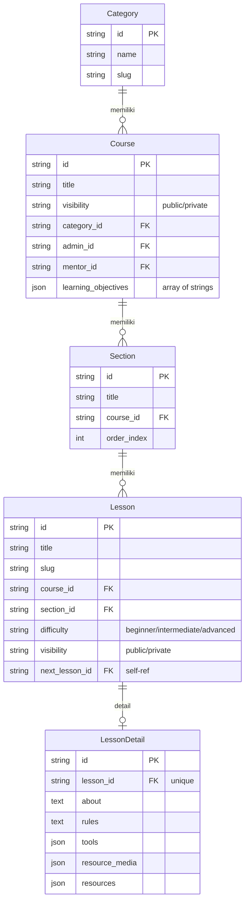
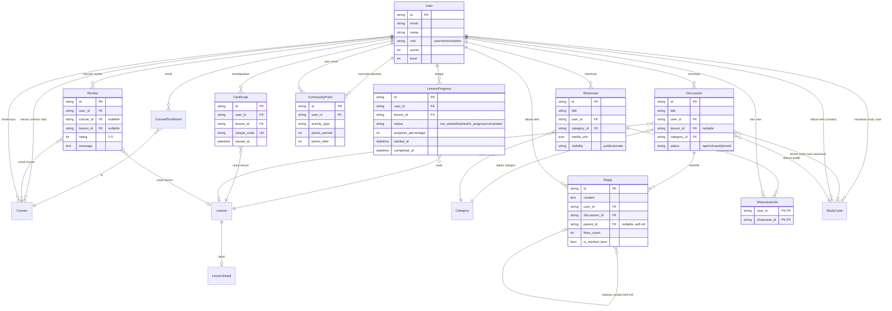
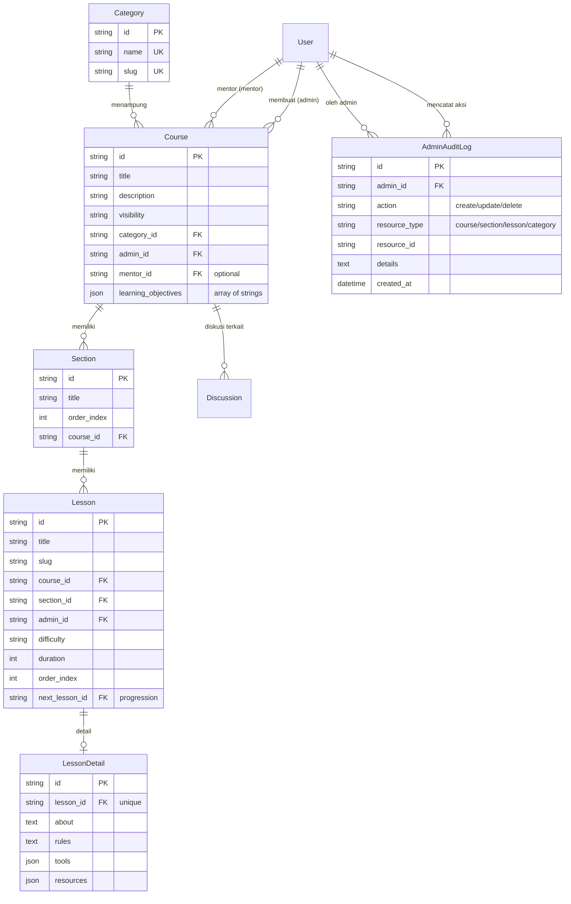
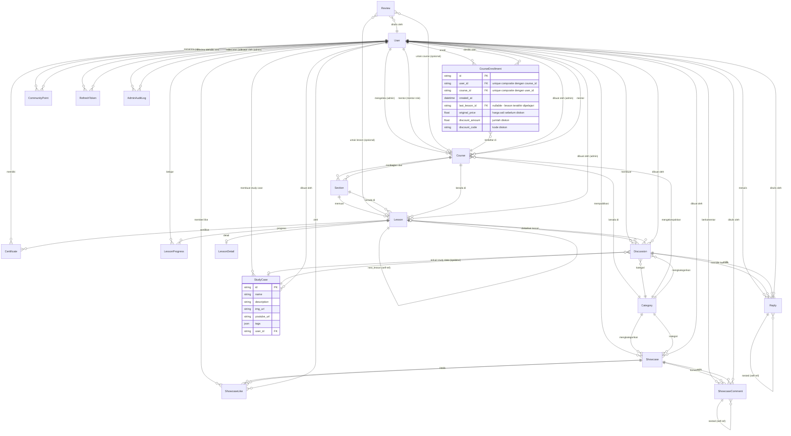

# Flow — JValleyverse

## Role & Permission Matrix

| Fitur                                                    | public | user | mentor | admin        |
| -------------------------------------------------------- | ------ | ---- | ------ | ------------ |
| Browse categories/courses/sections/lessons/study-cases   | ✓      | ✓    | ✓      | ✓            |
| Browse blogs                                             | ✓      | ✓    | ✓      | ✓            |
| Register/Login (Email & Google)                          | ✓      | -    | -      | -            |
| Belajar (start/progress/complete)                        | -      | ✓    | ✓      | ✓            |
| Buat/kelola discussion & reply                           | -      | ✓    | ✓      | ✓            |
| Buat/kelola showcase                                     | -      | ✓    | ✓      | ✓            |
| Like/unlike showcase & reply                             | -      | ✓    | ✓      | ✓            |
| Lihat certificate sendiri                                | -      | ✓    | ✓      | ✓            |
| Dashboard (widget stats)                                 | -      | ✓    | ✓      | ✓            |
| Lihat notifikasi sendiri                                 | -      | ✓    | ✓      | ✓            |
| Enroll course & enrolled-courses (lihat dgn is_enrolled) | -      | ✓    | ✓      | ✓            |
| My Courses / My Study Cases / My Certificates            | -      | ✓    | ✓      | ✓            |
| Mengelola course sbg mentor (terbatas)                   | -      | -    | ✓      | ✓            |
| Browse study cases & diskusi                             | ✓      | ✓    | ✓      | ✓            |
| CRUD categories                                          | -      | -    | -      | ✓            |
| CRUD courses                                             | -      | -    | -      | ✓            |
| CRUD sections                                            | -      | -    | -      | ✓            |
| CRUD lessons                                             | -      | -    | -      | ✓            |
| CRUD study cases                                         | -      | -    | -      | ✓            |
| Manage users                                             | -      | -    | -      | ✓            |
| Audit log (otomatis)                                     | -      | -    | -      | ✓ (tercatat) |

---

## ERD — Berdasarkan Point of View

### 1. Public POV (Browsing Tamu)

Tamu hanya melihat konten publik — tidak ada interaksi, tidak ada login.



---

### 2. User POV (Pembelajar)

User login, belajar, diskusi, showcase, dapat poin & sertifikat.



---

### 3. Admin POV (Pengelola Konten)

Admin mengelola seluruh konten pembelajaran. Admin adalah User dengan role = "admin".



---

### 4. System POV (Full ERD — Semua Entitas)

Relasi lengkap antar seluruh tabel dalam sistem.



---

## 1. Auth Flow

### Register

```
[Client]                    [Server]
   |  POST /api/auth/register  |
   |  {name, email, password}  |
   |-------------------------->|
   |                            | validasi input (name, email regex, password)
   |                            | bcrypt hash password
   |                            | FirstOrCreate user (role="user")
   |  201 {message}            |
   |<--------------------------|
```

### Login

```
[Client]                    [Server]
   |  POST /api/auth/login     |
   |  {email, password}        |
   |-------------------------->|
   |                            | FindUserByEmail
   |                            | bcrypt.CompareHashAndPassword
   |                            | GenerateJWT(access_token, 24h)
   |                            | GenerateRefreshToken(32 bytes hex, 7d)
   |                            | GenerateXSRFToken (cookie)
   |  200 {access_token,       |
   |        refresh_token,     |
   |        expires_in,        |
   |        xsrf_token}        |
   |<--------------------------|
```

### Google Login (One Tap)

```
[Client]                          [Server]
   |  POST /api/auth/google        |
   |  {token: "<google_id_token>"} |
   |------------------------------->|
   |                                | idtoken.Validate(context, token, clientID)
   |                                | Extract email, name, picture dari payload
   |                                | FindUserByEmail atau CreateUser (FirstOrCreate)
   |                                | GenerateJWT + RefreshToken + XSRFToken
   |  200 {access_token,           |
   |        refresh_token,         |
   |        expires_in,            |
   |        xsrf_token}            |
   |<-------------------------------|
```

Catatan:

- Google Client ID dikonfigurasi via env `GOOGLE_CLIENT_ID`
- Jika user sudah ada, avatar & name akan di-update dari Google
- User baru dibuat dengan `role="user"` dan `password=""` (tidak bisa login email)

### Token Refresh

```
[Client]                    [Server]
   |  POST /api/auth/refresh   |
   |  {refresh_token}          |
   |-------------------------->|
   |                            | ValidateRefreshToken (cek DB)
   |                            | GenerateJWT baru
   |  200 {access_token,       |
   |        expires_in}        |
   |<--------------------------|
```

### Logout

```
[Client]                    [Server]
   |  POST /api/auth/logout    |
   |  Authorization: Bearer    |
   |  {refresh_token?}         |
   |-------------------------->|
   |                            | RevokeRefreshToken (single) atau
   |                            | RevokeAllUserTokens
   |                            | Hapus XSRF cookie
   |  200 {message}            |
   |<--------------------------|
```

---

## 2. Admin Content Management Flow

### Create Content Chain (urutan wajib)

```
  1. Category     ──> POST /api/admin/categories
  2. Course       ──> POST /api/admin/courses       (memerlukan category_id, opsional mentor_id)
  3. Section      ──> POST /api/admin/courses/:course_id/sections
  4. Lesson       ──> POST /api/admin/lessons        (memerlukan course_id + section_id)
  5. Detail       ──> POST /api/admin/lessons/:id/details
  6. Study Case   ──> POST /api/admin/study-cases    (opsional category_id)
```

### State Machine Content

```
Course visibility: draft → published → archived
Lesson visibility: public | private (hanya admin yang lihat)
```

### Admin Guard Rules

- Admin hanya bisa **update/delete** konten yang `admin_id = miliknya` (owner guard)
- Saat **delete course**: cascade delete semua sections & lessons & lesson_details
- Saat **delete section**: cascade delete semua lessons
- Saat **delete lesson**: cascade delete certificates & discussions terkait
- Setiap admin action tercatat di `admin_audit_logs`:
  ```
  resource_type: "course" | "section" | "lesson" | "category" | "study_case" | "blog"
  action: "create" | "update" | "delete"
  ```

---

## 3. Public Browse Flow (with Enrollment)

```
[User]                          [API]
  | GET /api/categories            |
  |------------------------------->|
  | [{id, name, slug,             |
  |   description}]               |
  |<-------------------------------|

  | GET /api/categories/:category_id/courses  (Opt.JWT)
  |------------------------------->|
  | [{id, title, description,     |
  |   thumbnail, sections,        |
  |   admin_name,                 |
  |   is_enrolled: true/false}]   |  ← Jika user login, tiap course
  |<-------------------------------|     punya is_enrolled

  | GET /api/courses (Opt.JWT)    |
  | ?page=1&limit=10             |
  | &category_id=xxx             |  ← Filter by category
  | &min_price=0&max_price=100000|  ← Filter by price range
  |------------------------------->|
  | [{id, title, description,     |
  |   thumbnail, price,           |
  |   category, admin_name,       |
  |   is_enrolled: true/false}]   |
  |<-------------------------------|

  | GET /api/courses/:course_id (Opt.JWT)
  |------------------------------->|
  | {                              |  ← FindByIDWithSections:
  |   id, title, sections: [      |     preloads Admin, Category,
  |     {id, title, lessons: [    |     Sections (by order_index),
  |       {id, title, slug,       |     Sections.Lessons (by order_index),
  |        difficulty, duration,  |     Sections.Lessons.Details,
  |        details}]              |     Sections.Lessons.NextLesson
  |   ],                          |
  |   is_enrolled: true/false     |  ← Jika user login
  | }                             |
  |<-------------------------------|

  | GET /api/lessons/:id          |
  |------------------------------->|
  | {id, title, description,      |  ← FindPublicByID:
  |   difficulty, duration,       |     visibility="public"
  |   course, section,            |     preloads Course, Section,
  |   details (about, rules,      |     Admin, Details, NextLesson
  |     tools, resources)}        |
  |<-------------------------------|

  | GET /api/courses/:course_id/lessons/:slug
  |------------------------------->|
  | lesson detail + (jika user    |
  | login: sertakan progress)     |
  |<-------------------------------|
```

Catatan: `GET /api/categories/:slug` juga mengembalikan courses (tanpa sections/lessons).
Route bertanda `(Opt.JWT)` menggunakan `OptionalJWTAuth` — jika user membawa JWT, response menyertakan `is_enrolled`. Jika **tanpa JWT**, field `is_enrolled` **tidak muncul** sama sekali.

---

## 4. User Learning Flow

### State Machine LessonProgress

```
                  ┌──────────────┐
                  │  not_started  │  (default — tidak ada record)
                  └──────┬───────┘
                         │ POST /lessons/:id/start
                         v
                  ┌──────────────┐
         ┌───────│   started     │────────┐
         │       └──────┬───────┘        │
         │              │ PUT progress   │
         │              v                │
         │       ┌──────────────┐        │
         │       │ in_progress   │        │
         │       └──────┬───────┘        │
         │              │ PUT progress=100
         │              │ atau POST complete
         │              v                │
         │       ┌──────────────┐        │
         └──────>│  completed    │<───────┘
                 └──────────────┘
                        │
                        v
              ┌─────────────────┐
              │  50 points      │
              │  Certificate    │
              │  Achievement    │
              │  NextLesson (?) │
              └─────────────────┘
```

### Start Lesson

```
POST /api/lessons/:id/start
Authorization: Bearer <token>

Proses:
  1. Cek existing progress → jika ada, return existing
  2. Buat LessonProgress baru:
     - status = "started"
     - started_at = now
     - progress_percentage = 0

Response 200:
{
  "message": "Lesson started!",
  "progress": { id, user_id, lesson_id, status: "started",
                started_at, progress_percentage: 0 }
}
```

### Update Progress

```
PUT /api/lessons/:id/progress
Authorization: Bearer <token>

Request:
{
  "progress_percentage": 45,
  "notes": "Sedang belajar middleware"
}

Proses:
  1. Validasi 0 <= percentage <= 100
  2. Tentukan status otomatis:
     - percentage = 0   → "started"
     - 0 < percentage < 100 → "in_progress"
     - percentage = 100 → "completed" (+ set completed_at)
  3. Update record

Response 200: { id, status, progress_percentage, started_at, completed_at? }
```

### Complete Lesson

```
POST /api/lessons/:id/complete
Authorization: Bearer <token>

Proses (berurutan):
  1. Load LessonProgress → error 404 jika belum start
  2. Jika sudah completed → error "lesson already completed"
  3. Set status="completed", percentage=100, completed_at=now
  4. Buat Certificate:
     - unique_code = "CERT-" + uuid[:8]
     - badge_url dari lesson thumbnail
  5. AddPoints:
     - activity_type = "complete_lesson"
     - points = 50
     - metadata = { lesson_id, cert_code }
     - Internal: add CommunityPoint, update user.points, recalculate level
  6. Load lesson + next_lesson

Response 200:
{
  "message": "Lesson completed!",
  "progress": { ... },
  "certificate": {
    "id": "...",
    "unique_code": "CERT-abc12345",
    "lesson_id": "...",
    "issued_at": "..."
  },
  "achievement": {
    "type": "certificate",
    "title": "Nama Lesson",
    "unique_code": "CERT-abc12345",
    "issued_at": "..."
  },
  "next_lesson": { id, title, slug, difficulty, duration } | null,
  "points_awarded": 50
}
```

---

## 5. Certificate Flow

```
┌─────────────────────────────────────────────┐
│              CERTIFICATE FLOW                │
│                                             │
│  Created: otomatis saat CompleteLesson       │
│  Format code: CERT-{8 char uuid prefix}     │
│  Owner: hanya user yang complete lesson      │
│                                             │
│  Lihat milik sendiri:                        │
│    GET /api/users/me/certificates            │
│    → paginated, includes lesson_name         │
│                                             │
│  Lihat by code (owner/admin only):           │
│    GET /api/users/me/certificates/:code      │
│    → 403 jika bukan owner dan bukan admin    │
│    → includes achievement key                │
└─────────────────────────────────────────────┘
```

---

## 6. Discussion & Reply Flow

### Discussion CRUD

```
POST /api/discussions (JWT)
  Request: { title, content, lesson_id?, study_case_id?, category_id }
  Response 201: discussion object

GET /api/discussions (JWT)
  Query: ?page=1&lesson_id=xxx&study_case_id=xxx&limit=20
  Response: paginated {data: [...], pagination: {...}}

GET /api/discussions/:id (JWT)
  Response: { discussion + nested replies (threaded) }
  Catatan: views_count auto-increment setiap GET

PUT /api/discussions/:id (JWT)
  Guard: hanya owner
  Request: { title, content }

DELETE /api/discussions/:id (JWT)
  Guard: owner atau admin
  Cascade: hapus semua replies

POST /api/discussions/:id/close (JWT)
  Guard: owner
  Effect: status → "closed"
```

### Reply CRUD

```
POST /api/discussions/:id/replies (JWT)
  Request: { content, parent_id? }
  Response 201: reply object
  Points: +5 "create_reply"

PUT /api/replies/:id (JWT)
  Guard: owner

DELETE /api/replies/:id (JWT)
  Guard: owner atau admin
  Cascade: hapus child replies

POST /api/replies/:id/like (JWT)
  Effect: likes_count++
  Points: +3 untuk creator reply ("receive_reply_like")
  Skip: jika self-like

POST /api/replies/:id/best (JWT)
  Guard: owner dari discussion induk
  Effect: is_marked_best = true
  Points: +25 untuk creator reply ("best_answer")
```

### Nested Reply Structure

```
Discussion
├── Reply A (top-level, parent_id = null)
│   ├── Child Reply A1 (parent_id = Reply A.id)
│   └── Child Reply A2 (parent_id = Reply A.id)
├── Reply B (top-level)
│   └── Child Reply B1
└── Reply C (top-level)
```

---

## 7. Showcase Flow

### Showcase CRUD

```
POST /api/showcases (JWT)
  Request: { title, description, media_urls[], category_id, visibility }
  Points: +10 "showcase_created"
  Response 201

GET /api/showcases (public)
  Query: ?page=1&category_id=xxx&sort=newest|trending|most_liked
  Response: paginated {data, pagination}

GET /api/showcases/:id (public)
  Response: full detail with user, category, likes_count, views_count

PUT /api/showcases/:id (JWT)
  Guard: owner
  Request: { title, description, visibility }

DELETE /api/showcases/:id (JWT)
  Guard: owner
```

### Showcase Like/Unlike

```
POST /api/showcases/:id/like (JWT)
  Effect: buat ShowcaseLike record, likes_count++
  Points: +5 untuk creator ("receive_like")
  Skip: jika self-like atau sudah like

DELETE /api/showcases/:id/like (JWT)
  Effect: hapus ShowcaseLike record, likes_count--
```

Catatan: **ShowcaseComment** (nested comments) ada di model & migration tetapi **belum memiliki API endpoint** (tidak ada repository/service/handler).

---

## 8. User Dashboard, Profile & Activity Flow

### Dashboard Widgets

```
GET /api/users/me/dashboard (JWT)
  Response:
  {
    "courses_in_progress": 2,
    "courses_completed": 5,
    "courses_dropped": 1,
    "unread_notifications": 3
  }
```

Catatan: Widget ini menghitung LessonProgress milik user yang sedang login:

- `courses_in_progress` = lesson dengan status "in_progress"
- `courses_completed` = lesson dengan status "completed"
- `courses_dropped` = lesson dengan status "started" (pernah dibuka tapi tidak dilanjutkan)

### My Endpoints

```
POST /api/courses/:id/enroll            — Enroll ke course (JWT)
PUT  /api/courses/:id/last-lesson        — Update last lesson (JWT)
GET  /api/users/me/courses              — Course yang sudah dienroll (JWT, paginated)
GET  /api/users/me/discussions          — Diskusi milik saya (JWT)
GET  /api/users/me/showcases            — Showcase milik saya (JWT)
GET  /api/users/me/study-cases          — Study case milik saya (JWT)
GET  /api/users/me/blogs                — Blog milik saya (JWT, paginated, ?status=draft|published)
GET  /api/users/me/replies              — Reply milik saya (JWT, paginated)
GET  /api/users/me/certificates         — Sertifikat milik saya (JWT)
```

### Notifications

```
GET    /api/notifications/stream           — SSE real-time notification stream (JWT)
GET    /api/users/me/notifications         — Daftar notifikasi (JWT)
GET    /api/users/me/notifications/count   — Hitung notifikasi belum dibaca (JWT)
PUT    /api/users/me/notifications/:id/read — Tandai satu notifikasi terbaca (JWT)
PUT    /api/users/me/notifications/read-all — Tandai semua terbaca (JWT)
DELETE /api/users/me/notifications/:id     — Hapus notifikasi (JWT)
```

Notifikasi dibuat otomatis oleh sistem:

- Saat seseorang membalas diskusi → owner diskusi mendapat notif "new_reply"
- Saat reply di-like → creator reply mendapat notif "reply_like"
- Saat reply ditandai sebagai best answer → creator reply mendapat notif "best_answer"
- Saat showcase di-like → owner showcase mendapat notif "showcase_like"

### Real-time Notifications via SSE

Notifikasi real-time menggunakan **Server-Sent Events (SSE)** — protokol HTTP long-lived connection satu arah (server → client).

**Arsitektur:**

```
[Notifikasi Baru]            [Server]                        [Client Browser]
       │                        │                                │
       │  CreateNotification()   │                                │
       ├────────────────────────>│                                │
       │                        │  DB Save                        │
       │                        ├────┐                           │
       │                        │    │ simpan ke DB               │
       │                        │<───┘                           │
       │                        │                                │
       │                        │  Hub.Publish(userID, event)    │
       │                        ├────┐                           │
       │                        │    │ kirim ke channel user     │
       │                        │<───┘                           │
       │                        │                                │
       │                        │  SSE: event: notification     │
       │                        │  data: {type, title, ...}      │
       │                        ├───────────────────────────────>│
       │                        │                                │
       │                        │  (Client render toast/badge)   │
```

**Komponen:**

| File                                       | Fungsi                                                                                |
| ------------------------------------------ | ------------------------------------------------------------------------------------- |
| `internal/service/notification_hub.go`     | Singleton hub — menyimpan map `userID → []channel`, thread-safe dengan `sync.RWMutex` |
| `internal/handler/sse_handler.go`          | HTTP handler untuk SSE — subscribe ke hub, stream event, heartbeat 30s                |
| `internal/service/notification_service.go` | `CreateNotification()` — setelah simpan DB, panggil `hub.Publish()`                   |

**Endpoint:** `GET /api/notifications/stream` (JWT required)

**Format Event SSE:**

- `connected`: dikirim saat koneksi pertama terbuka
- `notification`: setiap ada notifikasi baru
- `: heartbeat` (comment): setiap 30 detik agar koneksi tidak diputus

Detail teknis lebih lanjut: lihat `sse_notification.md`

## 8. User Profile & Activity Flow (Original)

### Profile

```
GET /api/users/me (JWT)
  Response: full user object (termasuk email, points, level)

PUT /api/users/me (JWT)
  Request: { name, bio, avatar }

GET /api/users/me/activity (JWT)
  Response: paginated CommunityPoint records
  Tipe activity: lesson_completed, showcase_created,
                 showcase_liked, discussion_created,
                 discussion_reply, certificate_issued

GET /api/users/:id (public)
  Response: { id, name, avatar, level, points }
```

---

## 9. Gamification Flow

### Point System

| Aktivitas                 | Poin | activity_type                                     |
| ------------------------- | ---- | ------------------------------------------------- |
| Complete lesson           | 50   | lesson_completed                                  |
| Create showcase           | 10   | showcase_created                                  |
| Menerima like di showcase | 5    | receive_like                                      |
| Create discussion         | -    | - (belum diimplementasi)                          |
| Create reply              | 5    | create_reply                                      |
| Menerima like di reply    | 3    | receive_reply_like                                |
| Marked as best answer     | 25   | best_answer                                       |
| Certificate issued        | -    | certificate_issued (otomatis dari CompleteLesson) |

### Level System

```
Level 1: Beginner     0-99 pts     🌱
Level 2: Intermediate 100-499 pts  🌿
Level 3: Advanced     500-999 pts  🌳
Level 4: Expert       1000-1999 pts ⭐
Level 5: Master       2000+ pts     👑
```

Level user dihitung ulang setiap kali `AddPoints` dipanggil.

### Leaderboard

```
GET /api/leaderboard?limit=10 (public)
  Response: [{ rank, user_id, name, avatar, total_points, level }]
  Default limit: 10

GET /api/levels (JWT)
  Response: definisi semua level

GET /api/users/:id/points (public)
  Response: { user_id, name, total_points, current_level,
              recent_activity (last 10) }
```

---

## 10. Showcase Comment Model (Belum Ada API)

`ShowcaseComment` sudah ada di model & migration tapi **belum memiliki**:

- Repository
- Service
- Handler
- Route

Fitur ini perlu dibangun terpisah. Model sudah mendukung:

- Nested comments (ParentID → ChildComments)
- Soft delete
- Relasi ke User & Showcase

---

## 11. Complete Preload Tree

### GET /api/courses/:course_id (GetCourseWithSections)

```
Course
├── Admin
├── Category
├── Mentor
└── Sections (order by order_index ASC)
    └── Lessons (order by order_index ASC)
        ├── Details
        └── NextLesson
```

### GET /api/categories/:slug (GetCategoryBySlug)

```
Category
└── Courses (order by created_at DESC)
    ├── Admin (user)
    └── Mentor
```

Catatan: Sections/Lessons TIDAK di-preload untuk category view.

### GET /api/categories/:category_id/courses (ListCoursesByCategoryID)

```
Course[]
├── Admin
├── Category
└── Sections
```

Catatan: Lessons TIDAK di-preload.

### GET /api/lessons/:id (GetPublicLessonByID)

```
Lesson (visibility="public")
├── Course
├── Section
├── Admin
├── Details
└── NextLesson
```

### GET /api/study-cases/:id (GetStudyCase)

```
StudyCase
├── User (creator)
└── Discussions (last 10, order by created_at DESC)
    └── User
```

### GET /api/study-cases (ListStudyCases)

```
StudyCase[]
└── User (creator)
```

---

---

## 9b. DTO & Response Optimization

Semua response API menggunakan **DTO (Data Transfer Object)** — struct khusus yang hanya berisi field yang dibutuhkan frontend.

### Kenapa DTO?

1. **Payload lebih kecil** — Tidak ada field seperti `deleted_at`, `password`, `email` di endpoint publik
2. **Null safety** — `mentor` yang tidak ada jadi `null`, bukan `{id:"", name:"", ...}`
3. **No duplicate data** — Section di dalam Course detail tidak menyertakan `course_id` (redundan)
4. **Consistent naming** — Semua field pakai snake_case, tidak perlu mapping lagi di handler

### Contoh DTO vs Raw Domain

| Field                                 | Raw Domain (before)                                                                                        | DTO (after)                                       |
| ------------------------------------- | ---------------------------------------------------------------------------------------------------------- | ------------------------------------------------- |
| `GET /api/courses` category           | `{id, name, slug, description, created_at, updated_at, deleted_at, Courses[], Showcases[], Discussions[]}` | `{id, name, slug}`                                |
| `GET /api/courses` mentor             | `{id, email, password, name, avatar, bio, role, points, total_points, level, ...}`                         | `{id, name, avatar, role}` atau `null`            |
| `GET /api/courses/:course_id` section | `{..., course_id, course: {full course object}, ...}`                                                      | `{..., id, title, lessons}` tanpa course duplikat |
| All list responses                    | `[]map[string]interface{}` (untyped, error-prone)                                                          | Typed struct seperti `[]CourseListItem`           |

### DTO Layer

DTO structs dan converter functions berada di `internal/service/dto.go` dalam package `service`. Setiap service method memanggil converter (`toXxx()`) untuk mengubah domain model ke DTO sebelum dikembalikan ke handler.

```
[DB/GORM] → [Domain Model] → [Service: toDTO()] → [Handler: c.JSON()] → [Client]
```

Daftar lengkap DTO dan field-nya ada di **flowapi.md → DTO (Data Transfer Object) Pattern**

### Note:

- Admin CRUD endpoints (POST/PUT/DELETE) tetap return full domain object untuk fleksibilitas
- Hanya GET/list endpoints yang menggunakan DTO
- `CertificateItem.Achievement` berubah dari string `"certificate"` menjadi object `{"type": "certificate"}`

## 13. Idempotency Key — Safe Retry untuk Frontend

### Kenapa Frontend Perlu Tahu?

Idempotency Key mencegah **duplikasi akibat network retry**. Contoh kasus:

- User klik "Submit" 2x karena loading lama → duplikat review/discussion/showcase
- Fetch timeout → browser retry otomatis → terbuat 2x enrollment
- Jaringan tidak stabil → request sukses tapi response tidak sampai client → user refresh → submit ulang

Dengan Idempotency-Key, retry apapun aman karena server mendeteksi duplikat dan mengembalikan response yang **sama persis** tanpa memproses ulang.

### Cara Kerja (Frontend POV)

```
[Frontend]                          [Server]
   |                                  |
   | 1. Generate UUID unik           |
   |    uuid = crypto.randomUUID()   |
   |                                  |
   | 2. Kirim POST dengan header     |
   |    Idempotency-Key: <uuid>      |
   |--------------------------------->|
   |                                  | Cek Redis: uuid sudah ada?
   |                                  | → Belum → proses request
   |                                  | → Simpan response di Redis (24 jam)
   |  201 {showcase, dll}            |
   |<---------------------------------|
   |                                  |
   | 3. Network error / timeout      |
   |    (request sukses di server    |
   |    tapi response tidak sampe)   |
   |                                  |
   | 4. Retry dengan UUID yang SAMA  |
   |--------------------------------->|
   |                                  | Cek Redis: uuid sudah ada?
   |                                  | → Ada! Kembalikan response
   |                                  |   yang sama tanpa reproses
   |  201 {showcase, dll}            |
   |  X-Idempotency-Replayed: true   |
   |<---------------------------------|
   |                                  |
   | 5. Frontend bisa tetap pakai    |
   |    response (sama seperti fresh)|
```

### Implementasi Frontend (JavaScript)

```js
// ====== HELPER: Fungsi fetch dengan idempotency ======

async function idempotentFetch(url, options = {}) {
  const method = (options.method || "GET").toUpperCase();

  // Hanya POST/PUT/DELETE/PATCH yang butuh idempotency key
  if (!["GET", "HEAD", "OPTIONS"].includes(method)) {
    // Generate UUID unik untuk setiap request
    if (!options.headers) options.headers = {};
    options.headers["Idempotency-Key"] = crypto.randomUUID();
  }

  const response = await fetch(url, options);

  // Cek apakah response dari cache
  const isReplayed = response.headers.get("X-Idempotency-Replayed") === "true";

  return { response, isReplayed };
}

// ====== PENGGUNAAN: Retry otomatis dengan idempotency ======

async function safeCreateShowcase(data, maxRetries = 2) {
  const body = JSON.stringify(data);
  let lastError;

  for (let attempt = 0; attempt <= maxRetries; attempt++) {
    try {
      const { response, isReplayed } = await idempotentFetch("/api/showcases", {
        method: "POST",
        headers: { "Content-Type": "application/json" },
        body,
      });

      if (!response.ok) throw new Error(`HTTP ${response.status}`);

      const result = await response.json();

      if (isReplayed) {
        console.log("Response dari cache (safe retry) — no duplicate created");
      }

      return result;
    } catch (err) {
      lastError = err;
      if (attempt < maxRetries) {
        // Exponential backoff: 1s, 2s
        await new Promise((r) => setTimeout(r, 1000 * Math.pow(2, attempt)));
      }
    }
  }

  throw lastError;
}

// ====== GENERATE UUID (fallback untuk browser lama) ======

function generateUUID() {
  // crypto.randomUUID() tersedia di semua browser modern
  if (typeof crypto !== "undefined" && crypto.randomUUID) {
    return crypto.randomUUID();
  }
  // Fallback
  return "xxxxxxxx-xxxx-4xxx-yxxx-xxxxxxxxxxxx".replace(/[xy]/g, (c) => {
    const r = (Math.random() * 16) | 0;
    return (c === "x" ? r : (r & 0x3) | 0x8).toString(16);
  });
}
```

### Response Headers untuk Frontend

| Header                   | Value  | Kapan Muncul                                                           |
| ------------------------ | ------ | ---------------------------------------------------------------------- |
| `X-Idempotency-Replayed` | `true` | Hanya saat response dari cache. Berarti request duluan sudah diproses. |

**Catatan:** Jika header ini ada, frontend **tidak perlu menampilkan toast sukses lagi** (karena user sudah melihatnya di request pertama). Atau bisa tetap tampilkan dengan catatan "Data sudah tersimpan".

### Endpoints yang Mendukung Idempotency

Semua **POST/PUT/DELETE** berikut support `Idempotency-Key`:

**Auth:**

- `POST /api/auth/register`
- `POST /api/auth/login`
- `POST /api/auth/refresh`

**Protected (JWT required):**

- `POST /api/showcases` — Create showcase
- `PUT /api/showcases/:id` — Update showcase
- `DELETE /api/showcases/:id` — Delete showcase
- `POST /api/showcases/:id/like` — Like showcase
- `DELETE /api/showcases/:id/like` — Unlike showcase
- `POST /api/discussions` — Create discussion
- `PUT /api/discussions/:id` — Update discussion
- `DELETE /api/discussions/:id` — Delete discussion
- `POST /api/discussions/:id/close` — Close discussion
- `POST /api/discussions/:id/replies` — Create reply
- `PUT /api/replies/:id` — Update reply
- `DELETE /api/replies/:id` — Delete reply
- `POST /api/replies/:id/like` — Like reply
- `POST /api/replies/:id/best` — Mark best answer
- `POST /api/reviews` — Create review
- `PUT /api/reviews/:id` — Update review
- `DELETE /api/reviews/:id` — Delete review
- `POST /api/courses/:id/enroll` — Enroll course
- `POST /api/lessons/:id/start` — Start lesson
- `PUT /api/lessons/:id/progress` — Update progress
- `POST /api/lessons/:id/complete` — Complete lesson
- `PUT /api/users/me/notifications/:id/read` — Mark notif read
- `PUT /api/users/me/notifications/read-all` — Mark all read
- `DELETE /api/users/me/notifications/:id` — Delete notif
- `PUT /api/users/me` — Update profile

**Admin (JWT + admin role):**

- Semua POST/PUT/DELETE di `/api/admin/*`

### Penting untuk Frontend

1. **Key HARUS UUID v4** — Server validasi format ketat. String biasa ditolak.
2. **Key tidak wajib** — Jika tidak dikirim, request tetap diproses (tanpa idempotency protection)
3. **Error 400** — Jika UUID tidak valid:
   ```json
   { "error": "Idempotency-Key must be a valid UUID v4 (e.g. 550e8400-e29b-41d4-a716-446655440000)" }
   ```
4. **crypto.randomUUID()** — API browser standard untuk generate UUID (tersedia di Chrome, Firefox, Safari 15+)
5. **1 key = 1 request** — Generate key baru untuk setiap request. Jangan reuse key untuk request berbeda.
6. **TTL cache 24 jam** — Key kadaluarsa otomatis setelah 24 jam. Jika retry melebihi 24 jam, server proses ulang.

## 15. Security & Rate Limiting

### Rate Limit Tiers

| Tier        | Limit          | Target                 | Endpoint                                                         |
| ----------- | -------------- | ---------------------- | ---------------------------------------------------------------- |
| **Global**  | 200 req/min/IP | General browsing       | Semua route                                                      |
| **Content** | 60 req/min/IP  | Anti-scraping          | Public GET: courses, lessons, showcases, categories, study-cases |
| **Auth**    | 10 req/min/IP  | Brute force protection | `POST /api/auth/login`, `POST /api/auth/register`                |

### Anti-Scraping (ScraperGuard)

Semua public content endpoint diproteksi oleh middleware `ScraperGuard` yang memblokir request berdasarkan User-Agent:

| Kategori              | User-Agent                                                                                  | Action                            |
| --------------------- | ------------------------------------------------------------------------------------------- | --------------------------------- |
| **Empty**             | `(no User-Agent)`                                                                           | ❌ Blokir                         |
| **CLI tools**         | `curl`, `wget`, `libcurl`                                                                   | ❌ Blokir                         |
| **Python scrapers**   | `python-requests`, `aiohttp`, `scrapy`, `httpx`                                             | ❌ Blokir                         |
| **API clients**       | `PostmanRuntime`, `insomnia`, `HttpClient`, `okhttp`                                        | ❌ Blokir                         |
| **Programming langs** | `Java/`, `ruby`, `faraday`                                                                  | ❌ Blokir                         |
| **Generic bots**      | `bot`, `spider`, `crawler`                                                                  | ❌ Blokir (kecuali search engine) |
| **Search engines**    | `Googlebot`, `Bingbot`, `Slurp`, `DuckDuckBot`, `YandexBot`, `Baiduspider`                  | ✅ Izinkan                        |
| **Social media**      | `facebookexternalhit`, `Twitterbot`, `LinkedInBot`, `WhatsApp`, `TelegramBot`, `Discordbot` | ✅ Izinkan                        |

### Security Headers

Semua response menyertakan:

- `X-Content-Type-Options: nosniff` — cegah MIME sniffing
- `X-Frame-Options: DENY` — cegah clickjacking
- `X-XSS-Protection: 1; mode=block` — XSS filter
- `Referrer-Policy: strict-origin-when-cross-origin`
- `Permissions-Policy: geolocation=(), microphone=(), camera=()`
- `Strict-Transport-Security: max-age=31536000; includeSubDomains`

### XSRF Protection

Mutation endpoints (POST/PUT/DELETE) di protected `/api` mewajibkan header `X-XSRF-TOKEN` yang cocok dengan cookie.

### CORS

Origin diizinkan via env `CORS_ORIGINS` (default: localhost:3000, localhost:5173, vercel.app).

## 16. Data Initiation (Seed)

### Table Creation Order (AutoMigrate)

1. Users
2. Categories
3. Courses
4. Sections
5. Lessons
6. Lesson Details
7. Lesson Progresses
8. Certificates
9. Discussions
10. Replies
11. Showcases
12. Showcase Likes
13. Showcase Comments
14. Study Cases
15. Community Points
16. User Levels
17. Reviews
18. Refresh Tokens
19. Course Enrollments
20. Admin Audit Logs

### Custom ENUMs

```
userrole:           admin, user, mentor
coursestatus:       draft, published, archived
certificatestatus:  issued, revoked, expired
discussionstatus:   open, closed, pinned
showcasestatus:     draft, published, archived
showcasevisibility: public, private, draft
lessondifficulty:   beginner, intermediate, advanced
pointactivitytype:  showcase_created, showcase_liked,
                    discussion_created, discussion_reply,
                    lesson_completed, certificate_issued,
                    create_reply, receive_reply_like, best_answer,
                    receive_like, create_showcase, complete_lesson
```

---

## 17. File Upload (MinIO)

### Arsitektur

Semua upload file menggunakan endpoint terpusat `POST /api/upload` yang menyimpan file ke **MinIO** (S3-compatible storage) dan mengembalikan URL publik via CDN. Handler create/update cukup pakai URL tersebut sebagai string.

```
[Frontend]                    [Backend]                    [MinIO]
    |                             |                           |
    | POST /api/upload           |                           |
    | (multipart: file + folder) |                           |
    |---------------------------->|                           |
    |                             | UploadFile()             |
    |                             |-------------------------->|
    |                             |                           |
    | {url: "https://cdn/..."}   |                           |
    |<----------------------------|                           |
    |                             |                           |
    | POST /api/admin/courses    |                           |
    | {thumbnail: "<cdn-url>"}   |                           |
    |---------------------------->|                           |
```

### Endpoint

| Method | Path          | Auth | Middleware         |
| ------ | ------------- | ---- | ------------------ |
| POST   | `/api/upload` | JWT  | XSRF + Idempotency |

**Request:** `multipart/form-data` dengan field:

| Field    | Required | Contoh                                                      |
| -------- | -------- | ----------------------------------------------------------- |
| `file`   | ✅       | image.jpg (max 10MB)                                        |
| `folder` | ✅       | `courses`, `lessons`, `avatars`, `showcases`, `study-cases` |

**Validasi:**

- Folder: hanya alfanumerik + `-` + `_` (no path traversal)
- Ekstensi: `jpg`, `jpeg`, `png`, `gif`, `webp`, `svg`, `mp4`, `pdf`, `zip`
- Size: max 10MB

**Response (201):**

```json
{
  "url": "https://cdn.mohagussetiaone.my.id/jvalleyverse/courses/uuid.jpg",
  "object_name": "courses/uuid.jpg",
  "size": 245760,
  "content_type": "image/jpeg"
}
```

### Environment Variables

| Variable           | Default                             | Required |
| ------------------ | ----------------------------------- | -------- |
| `MINIO_ENDPOINT`   | `minio.mohagussetiaone.my.id`       | ✅       |
| `MINIO_ACCESS_KEY` | —                                   | ✅       |
| `MINIO_SECRET_KEY` | —                                   | ✅       |
| `MINIO_BUCKET`     | `jvalleyverse`                      | ✅       |
| `MINIO_CDN_URL`    | `https://cdn.mohagussetiaone.my.id` | ✅       |
| `MINIO_USE_SSL`    | `true`                              | ✅       |

### File Structure

```
# Object name format: {folder}/{uuid}.{ext}
# URL format:         {MINIO_CDN_URL}/{MINIO_BUCKET}/{folder}/{uuid}.{ext}

# Contoh:
https://cdn.mohagussetiaone.my.id/jvalleyverse/courses/a1b2c3d4.jpg
https://cdn.mohagussetiaone.my.id/jvalleyverse/avatars/e5f6g7h8.png
```

### MinIO Client Functions

| Function                                                    | Deskripsi                                          |
| ----------------------------------------------------------- | -------------------------------------------------- |
| `ConnectMinio()`                                            | Init client, cek & auto-create bucket saat startup |
| `UploadFile(ctx, file, folder, filename)`                   | Upload file → return object name (folder/uuid.ext) |
| `DeleteFile(ctx, objectName)`                               | Hapus object dari bucket                           |
| `GeneratePresignedUploadURL(ctx, folder, filename, expiry)` | Presigned URL untuk upload langsung dari client    |
| `IsAvailable()`                                             | Cek status koneksi MinIO                           |

### Contoh Frontend (JavaScript)

```js
async function uploadFile(file, folder) {
  const formData = new FormData();
  formData.append("file", file);
  formData.append("folder", folder);

  const res = await fetch("/api/upload", {
    method: "POST",
    headers: {
      Authorization: "Bearer " + token,
      "X-XSRF-TOKEN": getXSRFToken(),
      "Idempotency-Key": crypto.randomUUID(),
    },
    body: formData,
  });

  return res.json(); // { url, object_name, size, content_type }
}

// Upload thumbnail course
const { url } = await uploadFile(fileInput.files[0], "courses");
// url = "https://cdn.../jvalleyverse/courses/uuid.jpg"

// Kirim URL sebagai thumbnail
await fetch("/api/admin/courses", {
  method: "POST",
  headers: {
    /* ... */
  },
  body: JSON.stringify({ title: "...", thumbnail: url }),
});
```

### Gambaran File yang Terkena Upload

| Entity    | Field           | Tipe Lama             | Tipe Baru                      |
| --------- | --------------- | --------------------- | ------------------------------ |
| Course    | `thumbnail`     | string (URL manual)   | string (CDN URL dari upload)   |
| Lesson    | `thumbnail`     | string (URL manual)   | string (CDN URL dari upload)   |
| User      | `avatar`        | string (URL manual)   | string (CDN URL dari upload)   |
| Showcase  | `media_urls`    | []string (URL manual) | []string (CDN URL dari upload) |
| StudyCase | `img_url`       | string (URL manual)   | string (CDN URL dari upload)   |
| Blog      | `cover_img_url` | string (URL manual)   | string (CDN URL dari upload)   |

---

## 18. Blog Feature

### Role Access

| Fitur                    | public | user | mentor | admin |
| ------------------------ | ------ | ---- | ------ | ----- |
| Browse published blogs   | ✓      | ✓    | ✓      | ✓     |
| Read blog detail         | ✓      | ✓    | ✓      | ✓     |
| Buat/kelola blog sendiri | -      | ✓    | ✓      | ✓     |
| Kelola semua blog        | -      | -    | -      | ✓     |

### Blog CRUD

```
GET  /api/blogs (public)
  Query: ?page=1&limit=10&search=keyword&category_id=xxx&tag=golang
  Response: paginated {data: [...BlogListItem], pagination: {...}}
  Catatan: Hanya menampilkan blog dengan status="published"

GET  /api/blogs/:id (public)
  Response: BlogDetail (termasuk content penuh, author, category)

GET  /api/users/me/blogs (JWT)
  Query: ?page=1&limit=10&status=draft|published
  Response: Blog milik user yang login (semua status)

Admin:
  POST   /api/admin/blogs     — Buat blog baru
  PUT    /api/admin/blogs/:id  — Update blog
  DELETE /api/admin/blogs/:id  — Hapus blog
  GET    /api/admin/blogs      — List semua blog (semua status)
```

### Blog State

```
Status: draft → published → archived
```

### Blog DTO

**`BlogListItem`** — list blog

```json
{
  "id": "...",
  "title": "Belajar Go",
  "slug": "belajar-go",
  "description": "...",
  "cover_img_url": "https://cdn...",
  "tags": ["golang", "backend"],
  "status": "published",
  "author": { "id": "...", "name": "Admin", "avatar": "..." },
  "category": { "id": "...", "name": "Backend", "slug": "backend" },
  "created_at": "2026-06-15T12:00:00Z"
}
```

**`BlogDetail`** — blog detail

```json
{
  "id": "...",
  "title": "Belajar Go",
  "slug": "belajar-go",
  "description": "...",
  "content": "# Full markdown content...",
  "cover_img_url": "https://cdn...",
  "tags": ["golang", "backend"],
  "status": "published",
  "author": { "id": "...", "name": "Admin", "avatar": "..." },
  "category": { "id": "...", "name": "Backend", "slug": "backend" },
  "created_at": "2026-06-15T12:00:00Z",
  "updated_at": "2026-06-15T14:00:00Z"
}
```
