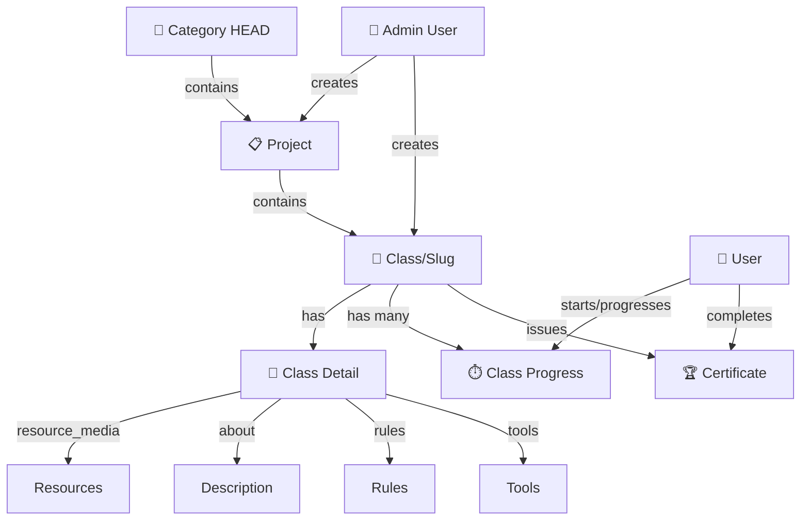

# 📚 Updated Project & Class Flow - NEW STRUCTURE

## 🎯 Overview - NEW HIERARCHY

```
Category (Top Level)
├─> Project 1
│   ├─> Class 1 (with slug)
│   │   └─> Class Detail
│   │       ├─ Resource Media
│   │       ├─ About
│   │       ├─ Rules
│   │       ├─ Tools
│   │       └─ Start/Progress
│   │
│   ├─> Class 2 (next_class_id → points to Class 1)
│   │   └─> Class Detail
│   │
│   └─> Class 3
│
└─> Project 2
    ├─> Class A
    └─> Class B
```

**Key Changes:**

- Category is now the HEAD (top grouping)
- Each Class has a **slug** for URL-friendly access
- Each Class has detailed content (resources, about, rules, tools)
- Classes linked together with **next_class_id** for progression
- Start indicator tracks user progress

---

## 📊 Updated Database Relationships



---

## 🗂️ Updated Database Schema

### 1. Category Table (HEAD)

```sql
CREATE TABLE categories (
    id BIGINT PRIMARY KEY AUTO_INCREMENT,
    name VARCHAR(255) NOT NULL UNIQUE,
    slug VARCHAR(255) NOT NULL UNIQUE,
    description TEXT,
    icon VARCHAR(255),
    color VARCHAR(20) DEFAULT '#3B82F6',
    created_at TIMESTAMP DEFAULT CURRENT_TIMESTAMP,
    updated_at TIMESTAMP,
    deleted_at TIMESTAMP NULL
);

-- Indexes
CREATE INDEX idx_category_slug ON categories(slug);
```

### 2. Project Table

```sql
CREATE TABLE projects (
    id BIGINT PRIMARY KEY AUTO_INCREMENT,
    title VARCHAR(255) NOT NULL,
    description TEXT,
    thumbnail VARCHAR(255),
    category_id BIGINT NOT NULL,
    admin_id BIGINT NOT NULL,
    visibility VARCHAR(50) DEFAULT 'public',  -- public | private
    created_at TIMESTAMP DEFAULT CURRENT_TIMESTAMP,
    updated_at TIMESTAMP,
    deleted_at TIMESTAMP NULL,

    FOREIGN KEY (category_id) REFERENCES categories(id),
    FOREIGN KEY (admin_id) REFERENCES users(id),
    INDEX idx_project_category (category_id),
    INDEX idx_project_admin (admin_id)
);
```

### 3. Class Table (with Slug & Progression)

```sql
CREATE TABLE classes (
    id BIGINT PRIMARY KEY AUTO_INCREMENT,
    project_id BIGINT NOT NULL,
    title VARCHAR(255) NOT NULL,
    slug VARCHAR(255) NOT NULL,              -- ← NEW: URL-friendly slug
    description VARCHAR(500),                 -- ← Short description
    thumbnail VARCHAR(255),
    difficulty VARCHAR(50) DEFAULT 'beginner',  -- beginner | intermediate | advanced
    duration INT,                            -- Duration in minutes
    order_index INT DEFAULT 0,               -- Sequence in project
    sequence_number INT,                     -- e.g., 1, 2, 3
    is_first BOOLEAN DEFAULT FALSE,          -- Is first class?
    next_class_id BIGINT NULL,               -- ← NEW: Link to next class
    admin_id BIGINT NOT NULL,
    visibility VARCHAR(50) DEFAULT 'public',
    created_at TIMESTAMP DEFAULT CURRENT_TIMESTAMP,
    updated_at TIMESTAMP,
    deleted_at TIMESTAMP NULL,

    FOREIGN KEY (project_id) REFERENCES projects(id) ON DELETE CASCADE,
    FOREIGN KEY (next_class_id) REFERENCES classes(id),
    FOREIGN KEY (admin_id) REFERENCES users(id),
    UNIQUE KEY unique_slug_per_project (project_id, slug),
    INDEX idx_class_project (project_id),
    INDEX idx_class_admin (admin_id),
    INDEX idx_class_sequence (project_id, sequence_number)
);
```

### 4. Class Details Table (NEW - Store Resources & Rules)

```sql
CREATE TABLE class_details (
    id BIGINT PRIMARY KEY AUTO_INCREMENT,
    class_id BIGINT NOT NULL UNIQUE,
    about TEXT,                              -- About/Content description
    rules LONGTEXT,                          -- Rules & requirements (Markdown)
    tools JSON,                              -- Tools needed: ["tool1", "tool2"]
    resource_media JSON,                     -- Media resources
                                              -- {
                                              --   "videos": ["url1", "url2"],
                                              --   "documents": ["url1"],
                                              --   "images": ["url1"]
                                              -- }
    resources JSON,                          -- Additional resources
                                              -- {
                                              --   "type": "pdf|video|link",
                                              --   "title": "Resource Title",
                                              --   "url": "https://..."
                                              -- }
    created_at TIMESTAMP DEFAULT CURRENT_TIMESTAMP,
    updated_at TIMESTAMP,

    FOREIGN KEY (class_id) REFERENCES classes(id) ON DELETE CASCADE,
    INDEX idx_class_detail (class_id)
);
```

### 5. Class Progress Table (NEW - Track User Progress)

```sql
CREATE TABLE class_progress (
    id BIGINT PRIMARY KEY AUTO_INCREMENT,
    user_id BIGINT NOT NULL,
    class_id BIGINT NOT NULL,
    status VARCHAR(50) DEFAULT 'not_started',  -- not_started | started | in_progress | completed
    started_at TIMESTAMP NULL,
    completed_at TIMESTAMP NULL,
    progress_percentage INT DEFAULT 0,
    notes TEXT,
    created_at TIMESTAMP DEFAULT CURRENT_TIMESTAMP,
    updated_at TIMESTAMP,

    UNIQUE KEY unique_user_class (user_id, class_id),
    FOREIGN KEY (user_id) REFERENCES users(id) ON DELETE CASCADE,
    FOREIGN KEY (class_id) REFERENCES classes(id) ON DELETE CASCADE,
    INDEX idx_user_class (user_id, class_id),
    INDEX idx_class_status (class_id, status),
    INDEX idx_user_progress (user_id, status)
);
```

### 6. Certificate Table (Updated)

```sql
CREATE TABLE certificates (
    id BIGINT PRIMARY KEY AUTO_INCREMENT,
    user_id BIGINT NOT NULL,
    class_id BIGINT NOT NULL,
    code VARCHAR(255) NOT NULL UNIQUE,
    badge_url VARCHAR(255),
    issued_at TIMESTAMP DEFAULT CURRENT_TIMESTAMP,
    expires_at TIMESTAMP NULL,
    created_at TIMESTAMP DEFAULT CURRENT_TIMESTAMP,
    updated_at TIMESTAMP,
    deleted_at TIMESTAMP NULL,

    FOREIGN KEY (user_id) REFERENCES users(id),
    FOREIGN KEY (class_id) REFERENCES classes(id),
    UNIQUE KEY unique_user_class_cert (user_id, class_id),
    INDEX idx_user_cert (user_id),
    INDEX idx_class_cert (class_id)
);
```

---

## 👥 Go Models (Domain)

### Class Model (Updated)

```go
type Class struct {
    ID           uint           `gorm:"primaryKey" json:"id"`
    CreatedAt    time.Time      `json:"created_at"`
    UpdatedAt    time.Time      `json:"updated_at"`
    DeletedAt    gorm.DeletedAt `gorm:"index" json:"-"`

    // Basic Info
    Title        string         `gorm:"not null;index" json:"title"`
    Slug         string         `gorm:"not null" json:"slug"` // ← NEW: URL slug
    Description  string         `gorm:"type:text" json:"description"`
    Thumbnail    string         `json:"thumbnail"`

    // Hierarchy
    ProjectID    uint           `gorm:"not null;index" json:"project_id"`
    Project      Project        `gorm:"foreignKey:ProjectID" json:"project,omitempty"`
    AdminID      uint           `gorm:"not null;index" json:"admin_id"`
    Admin        User           `gorm:"foreignKey:AdminID" json:"admin,omitempty"`

    // Learning Info
    Difficulty   string         `gorm:"default:'beginner'" json:"difficulty"`
    Duration     int            `json:"duration"` // in minutes
    OrderIndex   int            `gorm:"default:0" json:"order_index"`
    SequenceNum  int            `json:"sequence_number"`
    IsFirst      bool           `json:"is_first"`

    // Progression
    NextClassID  *uint          `json:"next_class_id"` // ← NEW: Link to next
    NextClass    *Class         `gorm:"foreignKey:NextClassID" json:"next_class,omitempty"`

    // Visibility
    Visibility   string         `gorm:"default:'public'" json:"visibility"`

    // Relationships
    Details      *ClassDetail   `gorm:"foreignKey:ClassID" json:"details,omitempty"`
    Progress     []ClassProgress `gorm:"foreignKey:ClassID" json:"-"`
    Certificates []Certificate  `gorm:"foreignKey:ClassID" json:"-"`
}
```

### ClassDetail Model (NEW)

```go
type ClassDetail struct {
    ID              uint      `gorm:"primaryKey" json:"id"`
    ClassID         uint      `gorm:"uniqueIndex;not null" json:"class_id"`
    Class           Class     `gorm:"foreignKey:ClassID" json:"class,omitempty"`

    About           string    `gorm:"type:text" json:"about"`              // Description
    Rules           string    `gorm:"type:text" json:"rules"`              // Rules/Requirements
    Tools           datatypes.JSONType `gorm:"type:json" json:"tools"`     // ["tool1", "tool2"]
    ResourceMedia   datatypes.JSONType `gorm:"type:json" json:"resource_media"`
    Resources       datatypes.JSONType `gorm:"type:json" json:"resources"`

    CreatedAt       time.Time `json:"created_at"`
    UpdatedAt       time.Time `json:"updated_at"`
}

// ResourceMedia structure
type ResourceMedia struct {
    Videos    []string `json:"videos"`
    Documents []string `json:"documents"`
    Images    []string `json:"images"`
}

// Resource structure
type Resource struct {
    Type  string `json:"type"`   // pdf | video | link | document
    Title string `json:"title"`
    URL   string `json:"url"`
}
```

### ClassProgress Model (NEW)

```go
type ClassProgress struct {
    ID                 uint           `gorm:"primaryKey" json:"id"`
    UserID             uint           `gorm:"not null;index" json:"user_id"`
    User               User           `gorm:"foreignKey:UserID" json:"user,omitempty"`
    ClassID            uint           `gorm:"not null;index" json:"class_id"`
    Class              Class          `gorm:"foreignKey:ClassID" json:"class,omitempty"`

    Status             string         `gorm:"default:'not_started'" json:"status"`
                                       // not_started | started | in_progress | completed
    StartedAt          *time.Time     `json:"started_at"`
    CompletedAt        *time.Time     `json:"completed_at"`
    ProgressPercentage int            `json:"progress_percentage"` // 0-100
    Notes              string         `json:"notes"`

    CreatedAt          time.Time      `json:"created_at"`
    UpdatedAt          time.Time      `json:"updated_at"`
}
```

---

## 🔄 Updated Flow Diagrams

### Flow 1: Category > Project > Classes Hierarchy

```
User Access Pattern:
│
├─→ GET /api/categories
│   Response: [Category 1, Category 2, ...]
│
├─→ GET /api/categories/{slug}
│   Response: { id: 1, name: "Web Dev", projects: [...] }
│        ↓
│   ┌─────────────────────────────┐
│   │ Projects in Category        │
│   ├─────────────────────────────┤
│   │ Project 1: JavaScript       │
│   │ Project 2: React Basics     │
│   │ Project 3: Node.js Advanced │
│   └─────────────────────────────┘
│
├─→ GET /api/projects/{id}
│   Response: { id: 1, title: "JavaScript", classes: [...] }
│        ↓
│   ┌──────────────────────┐
│   │ Classes in Project   │
│   ├──────────────────────┤
│   │ 1. JS Basics         │
│   │ 2. Functions         │
│   │ 3. Async/Await       │
│   │ 4. Advanced Patterns │
│   └──────────────────────┘
│
└─→ GET /api/projects/{id}/classes
    Response:
    [
      {
        id: 1,
        slug: "js-basics",
        title: "JS Basics",
        sequence: 1,
        next_class_id: 2
      },
      {
        id: 2,
        slug: "functions",
        title: "Functions",
        sequence: 2,
        next_class_id: 3
      },
      ...
    ]
```

### Flow 2: Class Detail with Start Button

```
┌─────────────────────────────────────────────┐
│ GET /api/classes/{project_id}/{slug}        │
├─────────────────────────────────────────────┤
│                                              │
│ Response:                                    │
│ {                                            │
│   "class": {                                 │
│     "id": 1,                                 │
│     "title": "JavaScript Basics",            │
│     "slug": "js-basics",                     │
│     "description": "...",                    │
│     "thumbnail": "...",                      │
│     "difficulty": "beginner",                │
│     "duration": 120,                         │
│     "sequence_number": 1,                    │
│     "next_class_id": 2                       │
│   },                                         │
│   "details": {                               │
│     "id": 1,                                 │
│     "about": "Learn JS fundamentals...",     │
│     "rules": "1. Install Node.js\n2. ...",  │
│     "tools": ["VS Code", "Node.js"],         │
│     "resource_media": {                      │
│       "videos": ["url1", "url2"],            │
│       "documents": ["url1"],                 │
│       "images": ["img1", "img2"]             │
│     }                                        │
│   },                                         │
│   "progress": {                              │
│     "status": "not_started",                 │
│     "progress_percentage": 0,                │
│     "started_at": null,                      │
│     "completed_at": null                     │
│   },                                         │
│   "next_class": {                            │
│     "id": 2,                                 │
│     "slug": "functions",                     │
│     "title": "Functions"                     │
│   }                                          │
│ }                                            │
│                                              │
└─────────────────────────────────────────────┘
```

### Flow 3: User Starts Class

```
┌────────────────────────────────────────┐
│ POST /api/classes/{id}/start            │
│ Authorization: Bearer JWT               │
├────────────────────────────────────────┤
│                                         │
│ Handler validates:                      │
│ ✓ User is authenticated                │
│ ✓ Class exists                         │
│ ✓ User can access class                │
│                                         │
│ Service logic:                          │
│ 1. Check if progress record exists     │
│ 2. If not → Create ClassProgress       │
│ 3. Update status = "started"           │
│ 4. Set started_at = now()              │
│ 5. Return updated progress             │
│                                         │
│ Response: {                             │
│   "message": "Class started!",          │
│   "progress": {                         │
│     "id": 1,                            │
│     "status": "started",                │
│     "started_at": "2024-01-15T10:30Z", │
│     "progress_percentage": 0,           │
│     "class_id": 1                       │
│   }                                     │
│ }                                       │
│                                         │
└────────────────────────────────────────┘
```

### Flow 4: User Mark Progress & Complete

```
┌─────────────────────────────────────────┐
│ PUT /api/classes/{id}/progress          │
│ Authorization: Bearer JWT                │
├─────────────────────────────────────────┤
│                                          │
│ Request:                                 │
│ {                                        │
│   "progress_percentage": 50,             │
│   "notes": "Completed section 1"         │
│ }                                        │
│                                          │
│ Service updates:                         │
│ → progress_percentage = 50               │
│ → status = "in_progress"                │
│ → updated_at = now()                    │
│                                          │
└─────────────────────────────────────────┘

         ↓↓↓ When complete (100%) ↓↓↓

┌─────────────────────────────────────────┐
│ POST /api/classes/{id}/complete         │
│ Authorization: Bearer JWT                │
├─────────────────────────────────────────┤
│                                          │
│ Service logic:                           │
│ 1. Mark progress as completed           │
│ 2. Set completed_at = now()             │
│ 3. status = "completed"                 │
│ 4. Create Certificate                   │
│ 5. Award Points & check level up        │
│ 6. Check if next class available        │
│ 7. Return certificate + next_class info │
│                                          │
│ Response:                                │
│ {                                        │
│   "message": "Class completed!",         │
│   "certificate": {                       │
│     "id": 1,                             │
│     "code": "CERT-2024-ABC123",          │
│     "badge_url": "...",                  │
│     "issued_at": "2024-01-15T10:30Z"     │
│   },                                     │
│   "progress": {                          │
│     "status": "completed",               │
│     "completed_at": "2024-01-15T11:50Z" │
│   },                                     │
│   "next_class": {                        │
│     "id": 2,                             │
│     "slug": "functions",                 │
│     "title": "Functions"                 │
│   },                                     │
│   "points_awarded": 100,                 │
│   "total_points": 500,                   │
│   "new_level": 2                         │
│ }                                        │
│                                          │
└─────────────────────────────────────────┘
```

---

## 📡 Updated API Endpoints

### Category Endpoints

```
GET /api/categories
  → List all categories

GET /api/categories/{slug}
  → Get category detail with projects

POST /api/admin/categories
  → Create category (admin)

PUT /api/admin/categories/{id}
  → Update category (admin)

DELETE /api/admin/categories/{id}
  → Delete category (admin)
```

### Project Endpoints

```
GET /api/categories/{category_id}/projects
  → List projects in category

GET /api/projects/{id}
  → Get project detail

POST /api/admin/projects
  → Create project (admin)

PUT /api/admin/projects/{id}
  → Update project (admin)

DELETE /api/admin/projects/{id}
  → Delete project (admin)
```

### Class Endpoints

```
GET /api/projects/{id}/classes
  → List all classes in project (with sequence)

GET /api/projects/{project_id}/classes/{slug}
  → Get class detail (with resources, rules, tools)

POST /api/admin/classes
  → Create class (admin)

PUT /api/admin/classes/{id}
  → Update class (admin)

DELETE /api/admin/classes/{id}
  → Delete class (admin)
```

### User Progress Endpoints (NEW)

```
GET /api/users/me/progress
  → Get user's all class progress

GET /api/classes/{id}/progress
  → Get my progress in class

POST /api/classes/{id}/start
  → Start class (create progress, set status=started)

PUT /api/classes/{id}/progress
  → Update progress (percentage, notes)

POST /api/classes/{id}/complete
  → Complete class (create certificate, award points)

GET /api/users/me/certificates
  → Get user's certificates

GET /api/certificates/{code}
  → Verify certificate (owner only)
```

---

## 🔑 Key Database Constraints

### Unique Constraints

```sql
-- Slug unique per project (can reuse slug across projects)
UNIQUE (project_id, slug)

-- User can have only one progress per class
UNIQUE (user_id, class_id)

-- User can get only one certificate per class
UNIQUE (user_id, class_id)
```

### Cascade Rules

```
Category deleted → Projects deleted → Classes deleted
                                   → ClassDetails deleted
                                   → ClassProgress deleted
                                   → Certificates deleted

Project deleted → Classes deleted → ClassDetails deleted
                               → ClassProgress deleted
                               → Certificates deleted

Class deleted → ClassDetails deleted
            → ClassProgress deleted
            → Certificates deleted
```

### Foreign Key Rules

```
ClassProgress (user_id) → Users (id)          [CASCADE on delete]
ClassProgress (class_id) → Classes (id)       [CASCADE on delete]

Certificate (user_id) → Users (id)            [CASCADE on delete]
Certificate (class_id) → Classes (id)         [CASCADE on delete]

Class (next_class_id) → Classes (id)          [SET NULL on delete]
Class (project_id) → Projects (id)            [CASCADE on delete]
```

---

## 🧪 Example Complete Journey

### 1. Admin Setup

```bash
# Create Category
POST /api/admin/categories
{
  "name": "Web Development",
  "slug": "web-dev",
  "description": "Complete web development course",
  "icon": "💻"
}
→ Response: { id: 1, slug: "web-dev" }

# Create Project in Category
POST /api/admin/projects
{
  "title": "JavaScript Mastery",
  "category_id": 1,
  "description": "Learn JS from zero to hero"
}
→ Response: { id: 1, category_id: 1 }

# Create Class 1
POST /api/admin/classes
{
  "project_id": 1,
  "title": "JS Basics",
  "slug": "js-basics",
  "description": "Learn fundamentals",
  "difficulty": "beginner",
  "duration": 120,
  "sequence_number": 1,
  "is_first": true
}
→ Response: { id: 1, project_id: 1, slug: "js-basics" }

# Create Class 2 (linked to Class 1)
POST /api/admin/classes
{
  "project_id": 1,
  "title": "Functions",
  "slug": "functions",
  "description": "Function declaration and usage",
  "difficulty": "beginner",
  "duration": 90,
  "sequence_number": 2
}
→ Response: { id: 2, project_id: 1 }

# Update Class 1 to link to Class 2
PUT /api/admin/classes/1
{
  "next_class_id": 2
}

# Create Class Detail for Class 1
POST /api/admin/classes/1/details
{
  "about": "Master the basics of JavaScript",
  "rules": "1. Install Node.js\n2. Use VS Code\n3. Practice daily",
  "tools": ["VS Code", "Node.js", "Chrome DevTools"],
  "resource_media": {
    "videos": ["url1", "url2"],
    "documents": ["syllabus.pdf"],
    "images": ["intro.jpg"]
  },
  "resources": [
    {
      "type": "link",
      "title": "MDN JavaScript",
      "url": "https://developer.mozilla.org/en-US/docs/Web/JavaScript"
    }
  ]
}
```

### 2. User Browse & Learn

```bash
# Browse categories
GET /api/categories
→ [Category 1, Category 2, ...]

# Open Web Dev category
GET /api/categories/web-dev
→ { projects: [Project 1, ...] }

# View JavaScript Mastery project
GET /api/projects/1
→ { Classes list: [Class 1, Class 2, ...] }

# View JS Basics class detail
GET /api/projects/1/classes/js-basics
→ {
    class: { id: 1, title: "JS Basics", ... },
    details: { ... },
    progress: { status: "not_started" },
    next_class: { id: 2, slug: "functions" }
  }

# User clicks START
POST /api/classes/1/start
Authorization: Bearer JWT
→ { progress: { status: "started", started_at: "..." } }

# User updates progress (50%)
PUT /api/classes/1/progress
Authorization: Bearer JWT
{ "progress_percentage": 50 }
→ { progress: { status: "in_progress", progress_percentage: 50 } }

# User completes class (100%)
POST /api/classes/1/complete
Authorization: Bearer JWT
→ {
    certificate: { code: "CERT-..." },
    next_class: { id: 2, slug: "functions" },
    points_awarded: 100
  }

# User continues to next class
GET /api/projects/1/classes/functions
→ { class: Class 2, progress: { status: "not_started" } }

# Start Class 2
POST /api/classes/2/start
Authorization: Bearer JWT
```

---

## 📊 Progress Tracking States

```
State Machine:
┌──────────────────┐
│  not_started     │
│  (0%)            │
└──────┬───────────┘
       │ User clicks START
       ↓
┌──────────────────┐
│  started         │
│  (0%)            │
└──────┬───────────┘
       │ User updates progress
       ↓
┌──────────────────┐
│  in_progress     │
│  (1-99%)         │
└──────┬───────────┘
       │ Reaches 100%
       ↓
┌──────────────────┐
│  completed       │
│  (100%)          │
│  Certificate ✓   │
└──────────────────┘
```

---

## 🔐 URL Structure with Slugs

```
/categories/{slug}               → Web development
/categories/{slug}/projects      → All projects in category
/projects/{id}                   → Specific project
/projects/{id}/classes           → All classes in project
/projects/{id}/classes/{slug}    → Specific class by slug
/projects/{id}/classes/{slug}/start       → Start class
/projects/{id}/classes/{slug}/complete    → Complete class
```

**Example URLs:**

- `/categories/web-dev`
- `/categories/web-dev/projects`
- `/projects/1/classes`
- `/projects/1/classes/js-basics`
- `/projects/1/classes/js-basics/start`

---

## 🎯 Summary of Changes

### Before (Old Structure)

```
Category → Project → Class → Certificate
```

### After (NEW Structure)

```
Category (HEAD)
  ├─ Project (organizes classes)
  │   ├─ Class (with slug)
  │   │   ├─ ClassDetail (about, rules, tools, resources)
  │   │   ├─ ClassProgress (status tracking: not_started → started → in_progress → completed)
  │   │   └─ Certificate (issued on completion)
  │   │
  │   └─ next_class_id (linear progression)
```

### New/Updated Tables

- ✅ class_details (stores about, rules, tools, resource_media)
- ✅ class_progress (tracks user progress: not_started, started, in_progress, completed)
- ✅ Classes now has (slug, next_class_id, sequence_number, is_first)

### New Features

- ✅ Class slug for URL-friendly routing
- ✅ Linear class progression (next_class_id)
- ✅ Start/Progress tracking with status
- ✅ Separate detail content (rules, tools, resources)
- ✅ Progress percentage tracking
- ✅ Better user journey visualization
