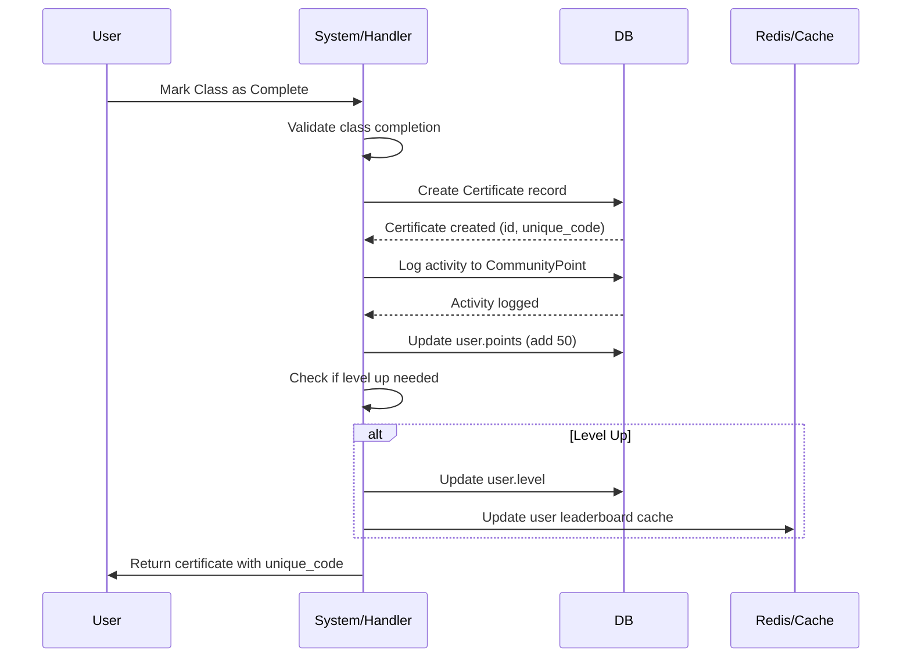
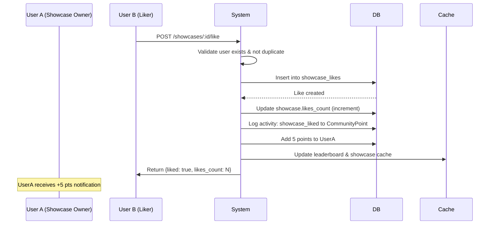
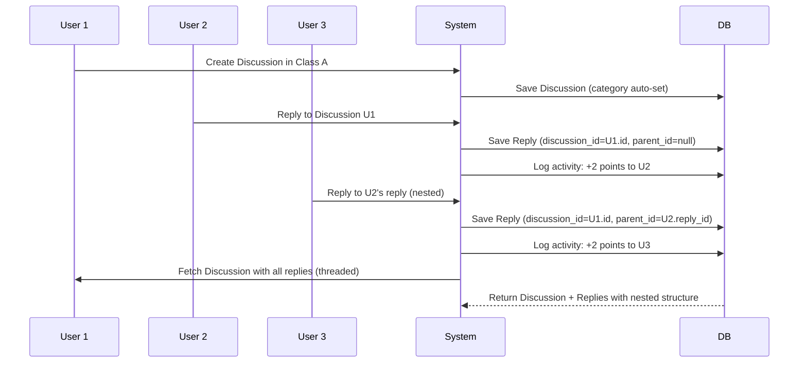
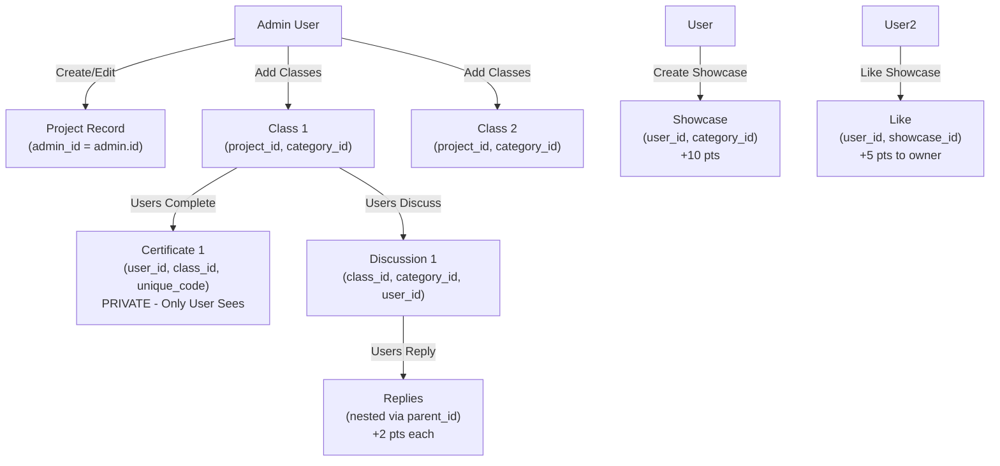

# JValleyVerse Implementation Guide

## 🎯 Fitur Utama Sistem

```
┌─────────────────────────────────────────────────────────────┐
│                   JVALLEYVERSE PLATFORM                     │
├─────────────────────────────────────────────────────────────┤
│ LEARNING SYSTEM        │ COMMUNITY ENGAGEMENT               │
│ ├─ Projects (Admin)    │ ├─ Discussions (Threaded)          │
│ ├─ Classes            │ ├─ Showcase Gallery                │
│ └─ Certificates       │ └─ Like/Comment System             │
├─────────────────────────────────────────────────────────────┤
│ GAMIFICATION           │ ADMIN MANAGEMENT                   │
│ ├─ Points System      │ ├─ Project CRUD                    │
│ ├─ Level Progression  │ ├─ Class Management                │
│ └─ Activity Logging   │ └─ User Moderation                 │
└─────────────────────────────────────────────────────────────┘
```

## 🔄 Key Business Flows

### 1. User Certificate Issuance Flow



### 2. Showcase Like/Unlike Flow



### 3. Discussion Reply (Nested) Flow



### 4. Admin Project Management (No Conflict) Flow



## 📊 Database Schema SQL References

### Core Tables Overview:

```sql
-- Users table with gamification
CREATE TABLE users (
    id SERIAL PRIMARY KEY,
    email VARCHAR(255) UNIQUE NOT NULL,
    password VARCHAR(255) NOT NULL,
    name VARCHAR(255) NOT NULL,
    avatar TEXT,
    bio TEXT,
    role ENUM('admin', 'user') DEFAULT 'user',
    is_active BOOLEAN DEFAULT true,
    points INT DEFAULT 0,
    total_points INT DEFAULT 0,
    level INT DEFAULT 1,
    created_at TIMESTAMP DEFAULT CURRENT_TIMESTAMP,
    updated_at TIMESTAMP DEFAULT CURRENT_TIMESTAMP,
    deleted_at TIMESTAMP NULL,
    INDEX (email),
    INDEX (role),
    INDEX (level)
);

-- Composite key for likes (efficient duplicate prevention)
CREATE TABLE showcase_likes (
    user_id INT NOT NULL,
    showcase_id INT NOT NULL,
    created_at TIMESTAMP DEFAULT CURRENT_TIMESTAMP,
    PRIMARY KEY (user_id, showcase_id),
    FOREIGN KEY (user_id) REFERENCES users(id) ON DELETE CASCADE,
    FOREIGN KEY (showcase_id) REFERENCES showcases(id) ON DELETE CASCADE
);

-- Activity logging for points tracking
CREATE TABLE community_points (
    id SERIAL PRIMARY KEY,
    user_id INT NOT NULL,
    activity_type ENUM(
        'certificate_issued',
        'showcase_created',
        'showcase_liked',
        'showcase_comment',
        'discussion_created',
        'discussion_reply',
        'reply_liked'
    ) NOT NULL,
    points_earned INT NOT NULL,
    points_after INT NOT NULL,
    level_after INT,
    metadata JSONB,
    description TEXT,
    created_at TIMESTAMP DEFAULT CURRENT_TIMESTAMP,
    FOREIGN KEY (user_id) REFERENCES users(id) ON DELETE CASCADE,
    INDEX (user_id),
    INDEX (activity_type),
    INDEX (created_at)
);

-- Certificates - PRIVATE per user
CREATE TABLE certificates (
    id SERIAL PRIMARY KEY,
    user_id INT NOT NULL UNIQUE,  -- One cert per user per class
    class_id INT NOT NULL,
    unique_code VARCHAR(255) UNIQUE NOT NULL,
    badge_url TEXT,
    issued_at TIMESTAMP DEFAULT CURRENT_TIMESTAMP,
    expires_at TIMESTAMP NULL,
    created_at TIMESTAMP DEFAULT CURRENT_TIMESTAMP,
    updated_at TIMESTAMP DEFAULT CURRENT_TIMESTAMP,
    deleted_at TIMESTAMP NULL,
    FOREIGN KEY (user_id) REFERENCES users(id) ON DELETE CASCADE,
    FOREIGN KEY (class_id) REFERENCES classes(id) ON DELETE CASCADE,
    UNIQUE KEY (user_id, class_id),
    INDEX (unique_code)
);

-- Replies with self-referential parent_id for nesting
CREATE TABLE replies (
    id SERIAL PRIMARY KEY,
    content TEXT NOT NULL,
    user_id INT NOT NULL,
    discussion_id INT NOT NULL,
    parent_id INT NULL,  -- NULL = top-level, NOT NULL = nested reply
    likes_count INT DEFAULT 0,
    is_marked_best BOOLEAN DEFAULT false,
    created_at TIMESTAMP DEFAULT CURRENT_TIMESTAMP,
    updated_at TIMESTAMP DEFAULT CURRENT_TIMESTAMP,
    deleted_at TIMESTAMP NULL,
    FOREIGN KEY (user_id) REFERENCES users(id) ON DELETE CASCADE,
    FOREIGN KEY (discussion_id) REFERENCES discussions(id) ON DELETE CASCADE,
    FOREIGN KEY (parent_id) REFERENCES replies(id) ON DELETE CASCADE,
    INDEX (discussion_id),
    INDEX (parent_id),
    INDEX (user_id)
);

-- Showcase with media URLs stored as JSONB
CREATE TABLE showcases (
    id SERIAL PRIMARY KEY,
    title VARCHAR(255) NOT NULL,
    description TEXT,
    media_urls JSONB,  -- ["https://...", "https://..."]
    user_id INT NOT NULL,
    category_id INT NOT NULL,
    status ENUM('published', 'draft', 'archived') DEFAULT 'published',
    visibility ENUM('public', 'private', 'friends_only') DEFAULT 'public',
    likes_count INT DEFAULT 0,
    views_count INT DEFAULT 0,
    created_at TIMESTAMP DEFAULT CURRENT_TIMESTAMP,
    updated_at TIMESTAMP DEFAULT CURRENT_TIMESTAMP,
    deleted_at TIMESTAMP NULL,
    FOREIGN KEY (user_id) REFERENCES users(id) ON DELETE CASCADE,
    FOREIGN KEY (category_id) REFERENCES categories(id),
    INDEX (user_id),
    INDEX (category_id),
    INDEX (visibility),
    INDEX (created_at)
);
```

## 🚀 Go Implementation Structure

### Directory Structure:

```
internal/
├── domain/models.go                 # ← Models moved here (complete)
├── handler/
│   ├── auth.go                      # Login, Register
│   ├── user.go                      # Profile, Leaderboard
│   ├── admin/
│   │   ├── project.go              # Admin Project CRUD
│   │   ├── class.go                # Admin Class CRUD
│   │   └── category.go             # Category management
│   ├── class.go                    # View classes
│   ├── certificate.go              # Issue & view certificates
│   ├── discussion.go               # Discussion CRUD
│   ├── reply.go                    # Reply CRUD
│   ├── showcase.go                 # Showcase CRUD
│   ├── like.go                     # Like/Unlike showcase
│   └── gamification.go             # Points, levels, leaderboard
├── repository/
│   ├── user.go                     # User queries
│   ├── project.go                  # Project queries
│   ├── showcase.go                 # Showcase queries
│   ├── community_point.go          # Activity logging
│   └── ...
├── service/
│   ├── auth.go                     # Auth business logic
│   ├── gamification.go             # Points calculation service
│   ├── certificate.go              # Certificate generation
│   └── showcase.go                 # Showcase operations
└── middleware/
    ├── jwt.go                      # JWT validation
    ├── rbac.go                     # Role-based access control
    └── rate_limit.go               # Rate limiting
```

## 🔐 Permission Rules (RBAC)

### Certificate Access:

```go
GET /api/v1/certificates/:code
- Owner: ✅ Can view
- Other User: ❌ Forbidden (404 or 403)
- Admin: ✅ Can view any (optional)
- Public: ❌ Cannot access

// Middleware check:
if certificate.UserID != claimsUserID && userRole != "admin" {
    return 403 Forbidden
}
```

### Showcase Management:

```go
PUT /api/v1/showcases/:id
- Owner: ✅ Can edit/delete
- Other User: ❌ Forbidden
- Admin: ✅ Can manage (force delete, archive)
- Public: ❌ Cannot edit

DELETE /api/v1/showcases/:id
- Owner: ✅ Can delete
- Admin: ✅ Can delete
- Other User: ❌ Forbidden
```

### Project Management:

```go
POST /api/v1/admin/projects
- Admin: ✅ Can create
- User: ❌ Forbidden
- Public: ❌ Forbidden

PUT /api/v1/admin/projects/:id
- Creator Admin: ✅ Can edit
- Other User: ❌ Forbidden
- Non-creator Admin: ✅ Can edit (your choice)
```

## 🎮 Gamification Implementation

### Points Award System:

```go
const (
    PointsCertificateIssued = 50
    PointsShowcaseCreated   = 10
    PointsShowcaseLiked     = 5  // Given to OWNER
    PointsShowcaseComment   = 2
    PointsDiscussionCreate  = 5
    PointsDiscussionReply   = 2
    PointsReplyLiked        = 1
)

type Points struct {
    CertificateIssued int = 50
    ShowcaseCreated   int = 10
    ShowcaseLiked     int = 5
    DiscussionReply   int = 2
}
```

### Level Calculation:

```go
func GetUserLevel(totalPoints int) int {
    if totalPoints >= 2000 {
        return 5 // Master
    } else if totalPoints >= 1000 {
        return 4 // Expert
    } else if totalPoints >= 500 {
        return 3 // Contributor
    } else if totalPoints >= 200 {
        return 2 // Learner
    }
    return 1 // Beginner
}

// Level thresholds in UserLevel table:
// Level 1: 0 - 199
// Level 2: 200 - 499
// Level 3: 500 - 999
// Level 4: 1000 - 1999
// Level 5: 2000+
```

### Activity Logging:

```go
func LogActivity(
    userID uint,
    activityType string,
    pointsEarned int,
    metadata map[string]interface{},
) {
    user.Points += pointsEarned
    user.TotalPoints += pointsEarned
    newLevel := CalculateLevel(user.TotalPoints)

    activity := CommunityPoint{
        UserID: userID,
        ActivityType: activityType,
        PointsEarned: pointsEarned,
        PointsAfter: user.Points,
        LevelAfter: newLevel,
        Metadata: toJSON(metadata),
        Description: fmt.Sprintf("%s earned %d points", activityType, pointsEarned),
    }

    db.Save(&activity)
    if newLevel != user.Level {
        user.Level = newLevel
        // Notify user: LEVEL UP!
    }
    db.Save(&user)
}
```

## 🛠️ Next Steps to Implement

1. **Update go.mod dependencies** - Ensure `gorm/datatypes` is included
2. **Create database migrations** - Run `AutoMigrate` function
3. **Implement handlers** - CRUD operations for each entity
4. **Implement repositories** - Database queries
5. **Implement services** - Business logic (gamification, certificates)
6. **Add middleware** - JWT, RBAC, Rate limiting
7. **Create routes** - API endpoints mapping
8. **Add request/response DTOs** - Validation & serialization
9. **Write tests** - Unit & integration tests

## 📝 Example: Create Showcase with Points

```go
// Handler
func CreateShowcase(c *fiber.Ctx) error {
    req := &CreateShowcaseRequest{}
    if err := c.BodyParser(req); err != nil {
        return err
    }

    userID := c.Locals("user_id").(uint)
    showcase := &domain.Showcase{
        Title: req.Title,
        Description: req.Description,
        MediaURLs: req.MediaURLs,
        UserID: userID,
        CategoryID: req.CategoryID,
        Visibility: "public",
        Status: "published",
    }

    // Create showcase
    if err := db.Create(showcase).Error; err != nil {
        return err
    }

    // Log activity & award points
    gamificationSvc.AwardPoints(userID, "showcase_created", 10, map[string]interface{}{
        "showcase_id": showcase.ID,
        "title": showcase.Title,
    })

    return c.JSON(showcase)
}
```

## 📚 API Response Examples

### Certificate (Private)

```json
{
  "id": 1,
  "user_id": 5,
  "class_id": 2,
  "unique_code": "CERT-2024-ABC123XYZ",
  "badge_url": "https://cdn.example.com/badges/master.png",
  "issued_at": "2024-01-15T10:30:00Z",
  "expires_at": null,
  "class": {
    "id": 2,
    "title": "Advanced Go Programming",
    "difficulty": "advanced"
  }
}
```

### Showcase with Likes

```json
{
  "id": 42,
  "title": "My First Machine Learning Model",
  "description": "Built a CNN classifier with 95% accuracy",
  "media_urls": ["https://...", "https://..."],
  "user": {
    "id": 5,
    "name": "John Dev",
    "level": 3,
    "points": 850
  },
  "category": {
    "id": 1,
    "name": "Machine Learning",
    "color": "#FF6B6B"
  },
  "likes_count": 24,
  "views_count": 156,
  "status": "published",
  "visibility": "public",
  "created_at": "2024-01-20T14:22:00Z"
}
```

### Discussion with Nested Replies

```json
{
  "id": 100,
  "title": "How to optimize database queries?",
  "content": "I have slow queries in production...",
  "class_id": 2,
  "user": {
    "id": 5,
    "name": "John Dev"
  },
  "replies": [
    {
      "id": 200,
      "content": "Use indexes!",
      "user": { "id": 10, "name": "Sarah" },
      "parent_id": null,
      "child_replies": [
        {
          "id": 201,
          "content": "Exactly, on foreign keys too!",
          "user": { "id": 11, "name": "Mike" },
          "parent_id": 200
        }
      ]
    }
  ]
}
```

---

**Ready to start implementation? Check out the models.go file for complete GORM structure!** 🚀
